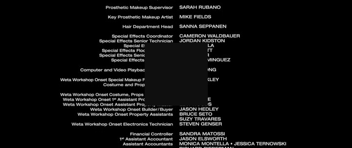

<p align="center">
        

<div align="center">
    <a href="https://github.com/AndresMWeber/Cinegraph">
        
    </a>
    <a href="https://github.com/AndresMWeber/Cinegraph/issues">
        
    </a>
    <a href="https://github.com/AndresMWeber/Cinegraph/blob/master/LICENSE">
        
    </a>
    <br />
    <a href=".">
        
    </a>
</div>
<br>

<p align="center"> A CLI tool that creates a kaleidescope-esque gradient image of your favorite movie.
    <br> 
</p>

<h3 align="center">
    <code>
    ·
    <a href="#installation">Installation</a>
    ·
    </code>
</h3>

## 📝 Table of Contents

- [📝 Table of Contents](#-table-of-contents)
- [🧐 About <a name = "about"></a>](#-about-)
- [🖥️ Screenshots <a name = "screenshots"></a>](#️-screenshots-)
- [💨 Quickstart <a name = "quickstart"></a>](#-quickstart-)
  - [Flags](#flags)
- [💾 Installation](#-installation)
  - [Prerequsites](#prerequsites)
  - [Install steps](#install-steps)
- [⛏️ Tech Stack <a name = "tech"></a>](#️-tech-stack-)
- [✍️ Authors <a name = "authors"></a>](#️-authors-)
- [🎉 Acknowledgements <a name = "acknowledgement"></a>](#-acknowledgements-)


## 🧐 About <a name = "about"></a>

A CLI tool that creates a kaleidescope-esque gradient image of your favorite movie.

## 🖥️ Screenshots <a name = "screenshots"></a>

<div align=center>
<h2>Total Recall</h2>


<h2>Elysium</h2>


<h2>Pacific Rim</h2>


<h2>Star Trek Into Darkness</h2>


<h2>Edge of Tomorrow</h2>


<h2>Example Write Frames</h2>




</div>

## 💨 Quickstart <a name = "quickstart"></a>
If you are running from the repository Cinegraph can be invoked using:
``` bash
$ poetry run exec 
```
or if you are running from a pip installation you should have the CLI command available:
``` bash
$ cinegraph
```

If you do not provide any positional arguments to specify input files it will automatically open a [Tkinter](https://docs.python.org/3/library/tkinter.html) file picker, you need to have a capable display window provider (if using WSL [Xserver](https://www.x.org/releases/X11R7.7/doc/man/man1/Xserver.1.xhtml) is a great option.)

Additionally you can run it with the following flags:
### Flags
```
NAME
    poetry run exec
    cinegraph

SYNOPSIS
    poetry run exec <flags> [FILES]...
    cinegraph <flags> [FILES]...
POSITIONAL ARGUMENTS
    FILES
        The files that you want to be processed.

FLAGS
    -c,--colors=COLORS
        Number of colors in the Cinegraph
        Example Input:
            100
    -b,--blur=BLUR
        Blur amount for the Cinegraph
        Example Input:
            5
    -r,--resolution=RESOLUTION
        Resolution for the Cinegraph
        Example Input:
            1000,1200
    -n,--no_frame=NO_FRAME
        Remove the white border + frame for the Cinegraph
    -m,--margin=MARGIN
        Set the margin (in pixels) for the border around the Cinegraph
        e.g. 25
    -w,--write_frames=WRITE_FRAMES
        Output the frames with a center square that denotes the dominant color.
```

## 💾 Installation

### From PyPi
#### Install steps
1. Install using pip: `pip install cinegraph`
2. You will then have the CLI command available to you:
``` bash
$ cinegraph
```

### From GitHub Repo Clone
#### Prerequsites

1. [Python](https://www.python.org/) and [Python Poetry](https://python-poetry.org/) is installed

#### Install steps
1. `poetry install` (To install in the top level directory always: `poetry config virtualenvs.in-project true`)


## ⛏️ Tech Stack <a name = "tech"></a>

- [Python](https://www.python.org/) - Software Development
- [OpenCV](https://opencv.org/) - Image Processing
- [Fire](https://github.com/google/python-fire) - CLI Framework

## ✍️ Authors <a name = "authors"></a>

<a href="https://github.com/andresmweber/">
    
</a>

## 🎉 Acknowledgements <a name = "acknowledgement"></a>

- [@FFMPEG](https://www.ffmpeg.org/) for providing amazing open source video solutions.
- [The Colors of Motion](https://thecolorsofmotion.com/) for being the inspiriation and the idea that I tried my best to mimic. 
